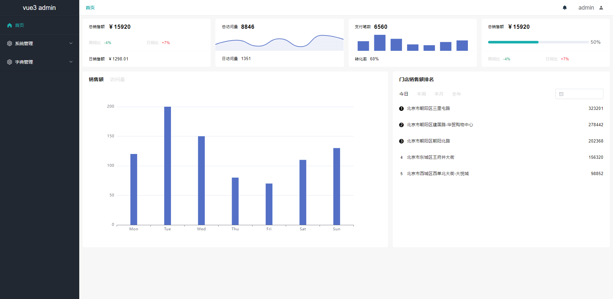
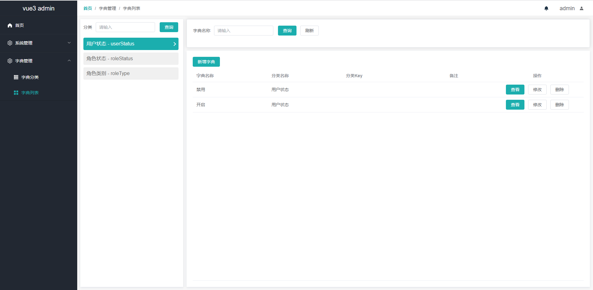

<!--
 * @Author: shaolong
 * @Date: 2022-08-24 12:01:00
 * @LastEditors: shaolong
 * @LastEditTime: 2022-11-18 17:14:03
 * @Description:
-->

# vue3-vite-template

🎉 基于 Vite 3.0 + Vue 3.0 + Vue-Router 4.0 + Vuex 4.0 + element-plus + vuex 的后台管理系统

## 简介

[vue3-element-admin](https://au1996.github.io/vue3-element-admin-ts) 是一个后台前端解决方案，它基于 [vue3](https://v3.cn.vuejs.org/guide/migration/introduction.html) 和 [element-plus](https://element-plus.gitee.io/#/zh-CN)实现。它使用了最新的前端技术栈，vite + vue3 + javascript ，提供最基础的框架模型，可以帮助你快速搭建企业级中后台产品原型。

## 项目预览图






## 前序准备

你需要在本地安装 [node](http://nodejs.org/) 和 [git](https://git-scm.com/)。本项目技术栈基于 [ES2015+](http://es6.ruanyifeng.com/)、[vue3](https://v3.cn.vuejs.org/)、[vuex](https://next.vuex.vuejs.org/)、[vue-router](https://next.router.vuejs.org/) 、[vite](https://cn.vitejs.dev/) 、[axios](https://github.com/axios/axios) 和 [element-plus](https://element-plus.gitee.io/#/zh-CN)，提前了解和学习这些知识会对使用本项目有很大的帮助。

## 开发

```bash
# 克隆项目
git clone https://github.com/shaolong1314/vue3-vite-template.git
# 进入项目目录
cd vue3-vite-template
# 安装依赖
yarn install
# 启动服务
yarn dev
```

## 发布

```bash
# 构建生产环境
yarn build
```

## 其它

```bash
# eslint代码格式检查
yarn lint
# prettier代码样式检查
yarn format
```

## 浏览器支持

本地开发推荐使用`Chrome`浏览器,在火狐浏览器进行开发相对卡顿。

支持现代浏览器, 不支持 IE

| [](http://godban.github.io/browsers-support-badges/)</br>IE | [](http://godban.github.io/browsers-support-badges/)</br>Edge | [](http://godban.github.io/browsers-support-badges/)</br>Firefox | [](http://godban.github.io/browsers-support-badges/)</br>Chrome | [](http://godban.github.io/browsers-support-badges/)</br>Safari |
| :--------------------------------------------------------------------------------------------------------------------------------------------------------------------------------------------------: | :----------------------------------------------------------------------------------------------------------------------------------------------------------------------------------------------------: | :---------------------------------------------------------------------------------------------------------------------------------------------------------------------------------------------------------------: | :-----------------------------------------------------------------------------------------------------------------------------------------------------------------------------------------------------------: | :-----------------------------------------------------------------------------------------------------------------------------------------------------------------------------------------------------------: |
|                                                                                             not support                                                                                              |                                                                                            last 2 versions                                                                                             |                                                                                                  last 2 versions                                                                                                  |                                                                                                last 2 versions                                                                                                |                                                                                                last 2 versions                                                                                                |

更多浏览器可以查看 [Can I Use Es Module](https://caniuse.com/?search=ES%20Module)

[JavaScript 版本传送门](https://github.com/shaolong1314/vue3-vite-template)

## License

[MIT](https://github.com/shaolong1314/vue3-vite-template/blob/master/LICENSE)

Copyright (c) 2022 shaolong_zheng
